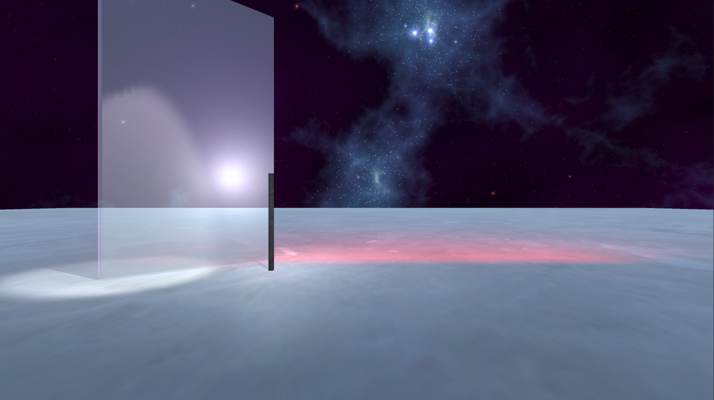

# CMPM163Labs

-------------------------------------LAB2-------------------------------------

part1: https://drive.google.com/file/d/1Vdr0fRA2dZnPUrLwK4TD3GhbNXpfo04h/view?usp=sharing

part2: 

-------------------------------------LAB3-------------------------------------
https://drive.google.com/file/d/1XW4NaiAkw417cSdWN2pFfmeFVfYi3jEc/view?usp=sharing

-------------------------------------LAB4-------------------------------------
https://drive.google.com/file/d/12UsVfbzpryKR21NmshWMTGII-ETNCfoX/view?usp=sharing

    - Cube1: using basic texture provided 197.jpg

    - Cube2: using basic texture provided with normal mapping 197.jpg & 197_norm.jpg

    - Cube3: using extra texture found in drive with coordinated normal mapping 176.jpg & 176_norm.jpg

    - Cube4: using basic shapders with texture 165.jpg

    - Cube5: by changing the value of uv coordinates, to map the texture only to part of the surface, then repeat the texture as tile 172.jpg

Answers:

    - a. x = 7u

    - b. y = 7 - 7v

    - c. (2.625, 5.25) is gray

-------------------------------------LAB5-------------------------------------
https://drive.google.com/file/d/1Za6EBqPMShJ9dGZJF19rjc-elWeP2OqN/view?usp=sharing

    - Modified tracks that makes race longer, also changed some environments to fit the new tracks

-------------------------------------LAB6-------------------------------------

Lighting:

    - Spotlight: Lighting to a specific cone of area

    - Directional Light: Lighting as sunlight, parallel projecting the light onto scene

    - Point Light: Lighting surrounding area with a light source

    - Area Light: Lighting the static object only at a low performance cost

Materials:

    - Changed rendering mode to Transparent

    - Changed color to be more like glass

    - Because galss in real world can reflect light while not all of them, some light pass through it, by simulating the same behavior in unity, it will look like a glass in real world.

Textures:

    - Texture1: floor texture as marble floor

    - Texture2: Torch texture as wood

Skyboxes:

    - Added a starry night skybox

-------------------------------------LAB7-------------------------------------
https://drive.google.com/file/d/1idV9TcbedpxL6bwhVww7SULFNKTEkbIr/view?usp=sharing

    - For mountain: I used 2 noise on top of each other to create a mountain terrain that looks random enough, and put a texture on it found online.

    - For water: I used a normal map texture found online and added blue color to it, make it looks like water, and then duplicate the normal texture while multiply the world space position with time value, make both water normal texture moving to a different direction. By blending both texture provide random waves to water.

Answers from partner:

    - "I did part 1."

    - "the most challenging part I found to be was getting the mountain mesh to fit into my 3D scene because it created an effect that had no height/depth to it, so the mountain shape I got was hollow. So I had some trouble figuring out how to make it look rock-like."

    - "The most interesting part for me was creating the water, because being able to change the speed and wave power with just 2 bars was really cool to see."