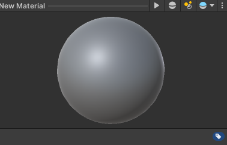

# CMPM163Labs

-------------------------------------LAB2-------------------------------------

part1: https://drive.google.com/file/d/1Vdr0fRA2dZnPUrLwK4TD3GhbNXpfo04h/view?usp=sharing

part2: 

-------------------------------------LAB3-------------------------------------
https://drive.google.com/file/d/1XW4NaiAkw417cSdWN2pFfmeFVfYi3jEc/view?usp=sharing

-------------------------------------LAB4-------------------------------------
https://drive.google.com/file/d/12UsVfbzpryKR21NmshWMTGII-ETNCfoX/view?usp=sharing

Cube1: using basic texture provided 197.jpg

Cube2: using basic texture provided with normal mapping 197.jpg & 197_norm.jpg

Cube3: using extra texture found in drive with coordinated normal mapping 176.jpg & 176_norm.jpg

Cube4: using basic shapders with texture 165.jpg

Cube5: by changing the value of uv coordinates, to map the texture only to part of the surface, then repeat the texture as tile 172.jpg

Answers:

a. x = 7u

b. y = 7 - 7v

c. (2.625, 5.25) is gray

-------------------------------------LAB5-------------------------------------
https://drive.google.com/file/d/1Za6EBqPMShJ9dGZJF19rjc-elWeP2OqN/view?usp=sharing

Modified tracks that makes race longer, also changed some environments to fit the new tracks

-------------------------------------LAB6-------------------------------------

- Lighting:
    - Spotlight: Lighting to a specific cone of area

    - Directional Light: Lighting as sunlight, parallel projecting the light onto scene

    - Point Light: Lighting surrounding area with a light source

    - Area Light: Lighting the static object only at a low performance cost

- Materials:

    - Changed rendering mode to Transparent

    - Changed color to be more like glass

- Textures:

    - Texture1: floor texture as marble floor

    - Texture2: Torch texture as wood

- Skyboxes:

