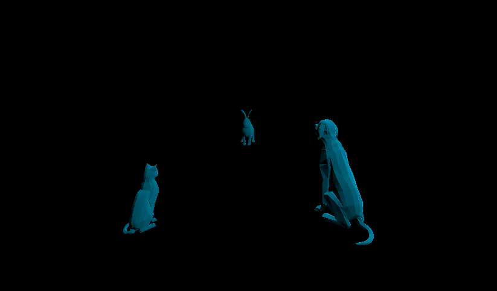

# CMPM163Labs

-------------------------------------LAB2-------------------------------------

part1: https://drive.google.com/file/d/1Vdr0fRA2dZnPUrLwK4TD3GhbNXpfo04h/view?usp=sharing

part2: 

-------------------------------------LAB3-------------------------------------
https://drive.google.com/file/d/1XW4NaiAkw417cSdWN2pFfmeFVfYi3jEc/view?usp=sharing

-------------------------------------LAB4-------------------------------------
Answers:
a. x = 7u
b. y = 7 - 7v
c. (2.625, 5.25) is gray